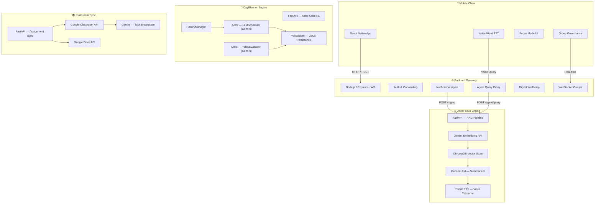

<p align="center">
  <h1 align="center">🔕 ChronoForge</h1>
  <p align="center">
    <strong>The AI Attention Operating System for College Students</strong>
  </p>
  <p align="center">
    
    
    
    
    
    
  </p>
</p>

---

## 📖 Overview

**DND Mode (ChronoForge)** is a full-stack, AI-powered productivity platform designed specifically for Indian college students. It intercepts device notifications in real-time, triages them using a **RAG pipeline** backed by Gemini embeddings + ChromaDB, and delivers concise voice summaries so users never need to touch their phone during study sessions.

Beyond notification triage, the system features a **reinforcement-learning-inspired daily scheduler** that generates opinionated, attendance-aware routines using an Actor-Critic architecture. A companion **Google Classroom sync** module fetches upcoming assignments and intelligently decomposes them into time-boxed sub-tasks using Gemini's structured output.

**Core Problem:** College students lose hours daily to notification-checking, context switching, and unstructured free time — DND Mode eliminates this decision fatigue entirely.

**Target Audience:** Indian college students managing dense timetables, attendance thresholds (75% rule), and multiple deadlines simultaneously.

---

## 🏗️ System Architecture & Core Logic

The platform is composed of five decoupled microservices communicating over HTTP and WebSocket:

1. **Mobile App** — React Native client with wake-word STT, onboarding, deep linking, focus mode, and group governance.
2. **Backend Gateway** — Node.js/Express + WebSocket server that routes notifications, speech-to-text, agent queries, and digital wellbeing data between the mobile client and AI microservices.
3. **DeepFocus Engine** — FastAPI service performing RAG-based notification triage via Gemini embeddings + ChromaDB, with on-device TTS voice response generation (Pocket TTS).
4. **DayPlanner Engine** — FastAPI service implementing an Actor-Critic RL loop: the Actor (Gemini LLM) generates daily routines, the Critic evaluates adherence and learns policy rules.
5. **Google Classroom Sync** — FastAPI service that fetches assignments from the Google Classroom API and uses Gemini structured output to break them into ≤60-minute sub-tasks.



### Data Flow: Notification Triage

1. Android device forwards notifications to **Backend Gateway** via `POST /api/notifications/ingest`.
2. Gateway relays the payload to **DeepFocus Engine**.
3. DeepFocus generates a **Gemini embedding** for the notification text and upserts it into **ChromaDB**.
4. Missed-call notifications are intercepted — a **Pocket TTS `.wav` file** is generated and returned directly, bypassing the vector store.
5. When the user issues a wake-word query, the **Agent Query** endpoint performs a cosine-similarity search over ChromaDB, feeds the top-K results to Gemini LLM for summarization, synthesizes the answer via Pocket TTS, and streams back the `.wav` audio.

### Data Flow: Actor-Critic Daily Planning

1. User submits personality profile, timetable, goals, and commitments to `/generate_daily_routine`.
2. The **Actor (LLMScheduler)** injects any learned policy rules from the **PolicyStore** into its Gemini system prompt, then generates a structured `DailyRoutine`.
3. At day's end, the user logs task completion via `/log_completion`.
4. The **Critic** compares the plan against actuals, scores performance, and proposes new `PolicyRule` objects — updating confidence scores for existing rules (reinforcement/decay). Rules below a minimum confidence threshold are pruned automatically.

---

## ✨ Key Features

- **Screenless Notification Triage** — RAG pipeline with semantic search over notifications; voice-first responses via on-device TTS so users never unlock their phone.
- **Missed-Call Interception** — Regex-based detection of missed/incoming calls with instant TTS audio generation, bypassing the vector store entirely.
- **Actor-Critic Daily Scheduler** — Reinforcement-learning-inspired loop where the Gemini "Actor" generates schedules and the Gemini "Critic" evaluates adherence, learning persistent policy rules over time.
- **Confidence-Weighted Policy Learning** — Scheduling rules are reinforced or decayed based on empirical data, with automatic pruning of low-confidence rules (`< 0.1`).
- **Google Classroom Sync with AI Task Decomposition** — Fetches assignments, downloads attachments (PDF/DOCX), extracts text, and uses Gemini structured output to chunk each assignment into ≤60-minute sub-tasks with completion weights.
- **Concurrent Gemini API Calls** — All assignment breakdowns fire in parallel via `asyncio.gather`, dramatically reducing sync latency.
- **Real-Time Group Governance** — WebSocket-based group system with join codes, deep linking (`dndmode://join/<code>`), and live focus-mode broadcast.
- **Wake-Word Voice Interface** — Background STT continuously listens for a wake word, enabling hands-free agent queries.
- **Digital Wellbeing Tracking** — App usage data ingestion endpoint for monitoring screen time and focus patterns.
- **Dockerized AI Microservices** — DeepFocus ships with a production-ready `Dockerfile` built on Python 3.12-slim.

---

## 🛠️ Tech Stack

| Layer              | Technology                                                                                  |
| ------------------ | ------------------------------------------------------------------------------------------- |
| **Mobile**         | React Native 0.84, TypeScript, Zustand (state), React Native Image Picker                   |
| **Backend**        | Node.js ≥22, Express 5, WebSocket (`ws`), JWT Auth, Multer (file uploads)                   |
| **AI / ML**        | Google Gemini 2.5 Flash (LLM + Embeddings), ChromaDB (vector store), Pocket TTS (ONNX)      |
| **Microservices**  | FastAPI, Uvicorn, Pydantic v2                                                               |
| **Classroom**      | Google Classroom API v1, Google Drive API v3, PyPDF2, python-docx                            |
| **Infrastructure** | Docker, dotenv, CORS middleware, SciPy (WAV I/O)                                            |
| **Testing**        | Jest (JS), pytest (Python)                                                                  |
| **Languages**      | TypeScript, JavaScript (CommonJS), Python 3.12                                              |

---

## 📋 Prerequisites

Ensure the following are installed on your system before proceeding:

| Requirement          | Minimum Version | Purpose                        |
| -------------------- | --------------- | ------------------------------ |
| **Node.js**          | `>= 22.11.0`   | Backend & mobile metro bundler |
| **Python**           | `>= 3.12`      | AI microservices               |
| **npm**              | `>= 10`        | JavaScript package management  |
| **pip**              | `>= 23`        | Python package management      |
| **Android SDK**      | API 34+         | Android builds                 |
| **Xcode** (macOS)    | 15+             | iOS builds (optional)          |
| **Docker** (optional)| 24+             | Containerized deployment       |
| **Google Cloud Credentials** | —       | Classroom API OAuth2           |

You will also need:

- A **Google Gemini API Key** (obtain from [Google AI Studio](https://aistudio.google.com/))
- **Google Cloud OAuth2 credentials** (`credentials.json`) for Classroom sync

---

## 🚀 Installation

### 1. Clone the Repository

```bash
git clone https://github.com/Mohi1038/DNDMode.git
cd DNDMode
```

### 2. Backend Gateway Setup

```bash
cd backend
npm install
cp .env.example .env   # Configure environment variables (see Configuration)
```

### 3. Mobile App Setup

```bash
cd app
npm install

# iOS only (macOS)
cd ios && pod install && cd ..
```

### 4. DeepFocus Engine Setup

```bash
cd DeepFocus
python3 -m venv .venv
source .venv/bin/activate
pip install -r requirements.txt
```

### 5. DayPlanner Engine Setup

```bash
cd DayPlanner
python3 -m venv .venv
source .venv/bin/activate
pip install fastapi uvicorn pydantic google-genai python-dotenv
```

### 6. Google Classroom Sync Setup

```bash
cd google_classroom_sync
python3 -m venv .venv
source .venv/bin/activate
pip install fastapi uvicorn pydantic google-genai python-dotenv \
    google-auth google-auth-oauthlib google-auth-httplib2 \
    google-api-python-client PyPDF2 python-docx
```

### 7. Docker (DeepFocus only)

```bash
cd DeepFocus
docker build -t chronoforge-deepfocus .
docker run -p 8000:8000 --env-file .env chronoforge-deepfocus
```

---

## ⚙️ Configuration

All services are configured via environment variables loaded from `.env` files. Create a `.env` file in each service directory with the appropriate keys.

### `.env.example`

```env
# ─── Backend Gateway ───────────────────────────
PORT=5000
AI_SERVER_HOST=127.0.0.1
AI_SERVER_PORT=8000
JWT_SECRET=your_jwt_secret_here

# ─── Mobile App ────────────────────────────────
SERVER_URL=http://<your-server-ip>:5000

# ─── DeepFocus Engine ─────────────────────────
GEMINI_API_KEY=your_gemini_api_key_here
GEMINI_EMBEDDING_MODEL=gemini-embedding-001
GEMINI_LLM_MODEL=gemini-2.5-flash
CHROMA_PERSIST_DIR=./data/chroma
CHROMA_COLLECTION_NAME=chronoforge_notifications
TOP_K=8
CORS_ORIGINS=*
TTS_VOICE=alba
HOST=0.0.0.0
PORT=8000
LOG_LEVEL=INFO

# ─── DayPlanner Engine ────────────────────────
GEMINI_API_KEY=your_gemini_api_key_here

# ─── Google Classroom Sync ────────────────────
GOOGLE_API_KEY=your_gemini_api_key_here
# Also requires credentials.json and token.json in the module directory
```

> **Note:** Never commit `.env` files or `credentials.json` / `token.json` to version control. Ensure they are listed in `.gitignore`.

---

## 🔌 Usage & API Reference

### Starting All Services

```bash
# Terminal 1 — Backend Gateway
cd backend
npm run dev

# Terminal 2 — DeepFocus Engine
cd DeepFocus
python main.py

# Terminal 3 — DayPlanner Engine
cd DayPlanner
uvicorn main:app --host 0.0.0.0 --port 8001 --reload

# Terminal 4 — Classroom Sync
cd google_classroom_sync
python main.py

# Terminal 5 — Mobile App
cd app
npx react-native run-android
```

### API Endpoints

#### Backend Gateway (`http://localhost:5000`)

| Method | Endpoint                            | Description                               |
| ------ | ----------------------------------- | ----------------------------------------- |
| `GET`  | `/health`                           | Health check                              |
| `GET`  | `/api/test`                         | Server connectivity test                  |
| `POST` | `/api/auth/login`                   | User authentication                       |
| `POST` | `/api/auth/signup`                  | User registration                         |
| `POST` | `/api/onboarding/profile`           | Submit onboarding profile                 |
| `POST` | `/api/timetable/generate`           | AI-powered timetable generation           |
| `POST` | `/api/notifications/ingest`         | Forward device notification               |
| `POST` | `/api/stt/transcribe`               | Speech-to-text transcription              |
| `POST` | `/api/agent/query`                  | Voice agent query (proxied to DeepFocus)  |
| `GET`  | `/api/audio/:file`                  | Serve generated audio files               |
| `POST` | `/api/digital-wellbeing/ingest`     | App usage data ingestion                  |
| `POST` | `/api/groups/create`                | Create a focus group                      |
| `POST` | `/api/groups/join`                  | Join a group via invite code              |
| `GET`  | `/api/governance/rules`             | Fetch governance rules                    |
| `GET`  | `/join/:code`                       | Web deep-link page for group invites      |
| `WS`   | `/ws/groups?groupId=&userName=`     | Real-time group updates                   |

#### DeepFocus Engine (`http://localhost:8000`)

| Method | Endpoint                              | Description                                  |
| ------ | ------------------------------------- | -------------------------------------------- |
| `GET`  | `/healthz`                            | Health check                                 |
| `POST` | `/api/v1/notifications/ingest`        | Ingest notification + embed into ChromaDB    |
| `POST` | `/api/v1/agent/query`                 | RAG query → Gemini summary → TTS `.wav`      |

**Agent Query — Request Body:**

```json
{
  "query": "Do I have any important messages?",
  "topK": 5
}
```

**Agent Query — Response:** Returns a `audio/wav` file with headers `X-Response-Text` and `X-Matched-Notifications`.

#### DayPlanner Engine (`http://localhost:8001`)

| Method | Endpoint                        | Description                                  |
| ------ | ------------------------------- | -------------------------------------------- |
| `POST` | `/generate_daily_routine`       | Generate an optimized daily routine          |
| `POST` | `/log_completion`               | Log task completion for the day              |
| `POST` | `/trigger_reflection`           | Run the Critic evaluation on a specific day  |
| `GET`  | `/view_policy/{user_id}`        | Inspect learned scheduling policy rules      |

**Generate Routine — Request Body:**

```json
{
  "user_id": "student_001",
  "current_date": "2026-02-28",
  "current_day": "Saturday",
  "personality": {
    "chronotype": "early_bird",
    "energy_peaks": ["06:00-11:00", "16:00-20:00"],
    "distraction_triggers": ["Instagram", "YouTube"],
    "focus_style": "pomodoro"
  },
  "timetable": [],
  "long_term_goals": [],
  "short_term_goals": [],
  "misc_commitments": []
}
```

#### Google Classroom Sync (`http://localhost:8099`)

| Method | Endpoint                        | Description                                       |
| ------ | ------------------------------- | ------------------------------------------------- |
| `GET`  | `/api/v1/sync-and-breakdown`    | Fetch upcoming assignments + AI task breakdown     |
| `GET`  | `/files/{path}`                 | Serve downloaded assignment attachments            |

---

## 📁 Project Structure

```
DNDMode/
├── app/                              # React Native mobile application
│   ├── App.tsx                       # Root component — routing, deep linking, wake-word STT
│   ├── src/
│   │   ├── screens/                  # UI screens
│   │   │   ├── LoginScreen.tsx       #   Authentication
│   │   │   ├── SignUpScreen.tsx      #   Registration
│   │   │   ├── ProfilingFlow.tsx     #   User onboarding (personality, timetable, goals)
│   │   │   ├── MainLandingPage.tsx   #   Primary dashboard
│   │   │   ├── FocusModeScreen.tsx   #   Focus session management
│   │   │   ├── GroupDashboardScreen.tsx  # Group governance dashboard
│   │   │   ├── DigitalGovernanceScreen.tsx  # Screen-time governance rules
│   │   │   └── SuggestedTimetableScreen.tsx # AI-generated timetable preview
│   │   ├── services/                 # Platform service wrappers
│   │   │   ├── speechService.ts      #   Wake-word detection + STT
│   │   │   ├── notificationService.ts #  Notification forwarding
│   │   │   ├── focusModeService.ts   #   Focus mode state management
│   │   │   ├── audioPlayerService.ts #   TTS audio playback
│   │   │   ├── digitalWellbeingService.ts # App usage tracking
│   │   │   └── AppTimerService.ts    #   Background timer
│   │   ├── store/                    # Zustand state management
│   │   ├── config/                   # App configuration
│   │   └── utils/                    # Shared utilities
│   ├── android/                      # Android native project
│   ├── ios/                          # iOS native project
│   └── package.json
│
├── backend/                          # Node.js backend gateway
│   ├── src/
│   │   ├── index.ts                  # Main server — Express + WebSocket setup
│   │   ├── controllers/              # TypeScript controllers (auth, onboarding, groups)
│   │   ├── routes/                   # TypeScript route definitions
│   │   └── middleware/               # Auth & logging middleware
│   ├── controllers/                  # JavaScript controllers (notifications, STT, agent)
│   ├── routes/                       # JavaScript route definitions
│   ├── services/                     # Business logic services
│   ├── server.js                     # Legacy JS entrypoint
│   └── package.json
│
├── DayPlanner/                       # AI daily scheduler — Actor-Critic RL loop
│   ├── main.py                       # FastAPI app — endpoints for routine gen, logging, reflection
│   ├── llm_engine.py                 # Actor — Gemini-powered routine generator
│   ├── critic.py                     # Critic — evaluates plan vs. completion, proposes rules
│   ├── models.py                     # Pydantic schemas (DailyInput, DailyRoutine, TimeBlock)
│   ├── rl_models.py                  # RL schemas (CompletionLog, PolicyRule, CriticEvaluation)
│   ├── policy_store.py               # Persistent per-user policy (JSON) with confidence decay
│   └── history_manager.py            # Per-user history tracking
│
├── DeepFocus/                        # Screenless notification triage engine
│   ├── main.py                       # FastAPI app — RAG ingest, agent query, TTS generation
│   ├── requirements.txt              # Python dependencies
│   └── Dockerfile                    # Production container (Python 3.12-slim)
│
├── google_classroom_sync/            # Google Classroom integration
│   ├── main.py                       # FastAPI app — assignment fetch + Gemini task breakdown
│   ├── credentials.json              # OAuth2 client credentials (not committed)
│   └── token.json                    # OAuth2 refresh token (not committed)
│
├── unit_tests/                       # Cross-module test suite
│   ├── test_deep_focus_server.py     # DeepFocus API tests
│   ├── test_gc_sync.py               # Classroom sync tests
│   ├── test_asign_prediction.py      # Assignment prediction tests
│   └── tts_test.py                   # TTS generation tests
│
└── package.json                      # Root workspace dependencies
```

---

<p align="center">
  Built with ☕ by the <strong>ChronoForge</strong> team.
</p>
